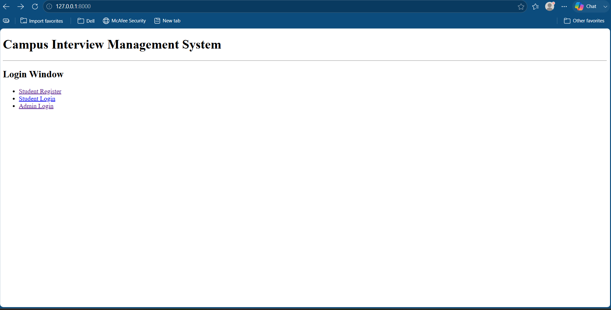
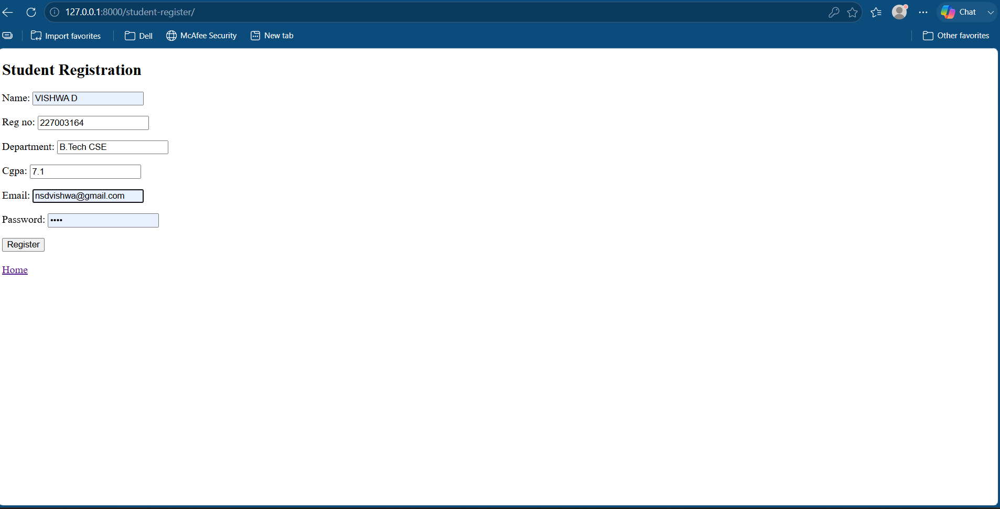
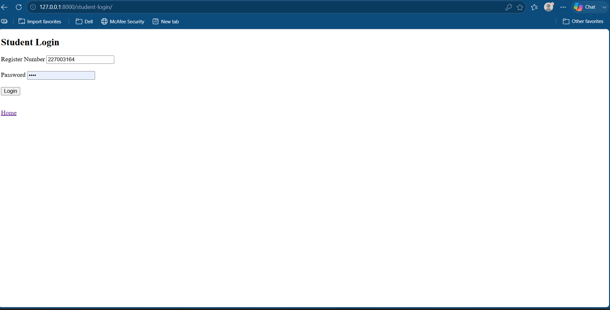
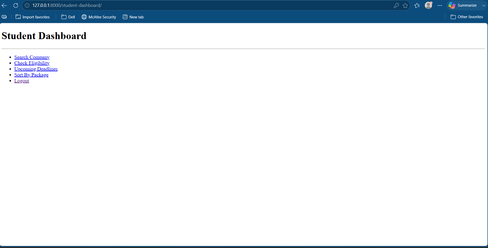
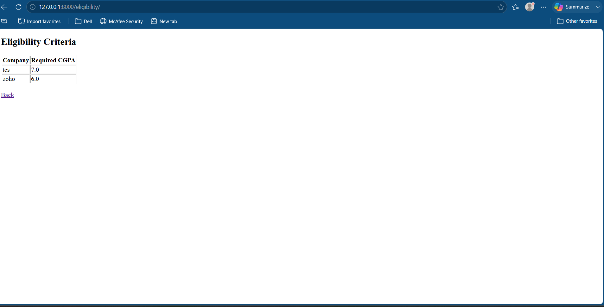
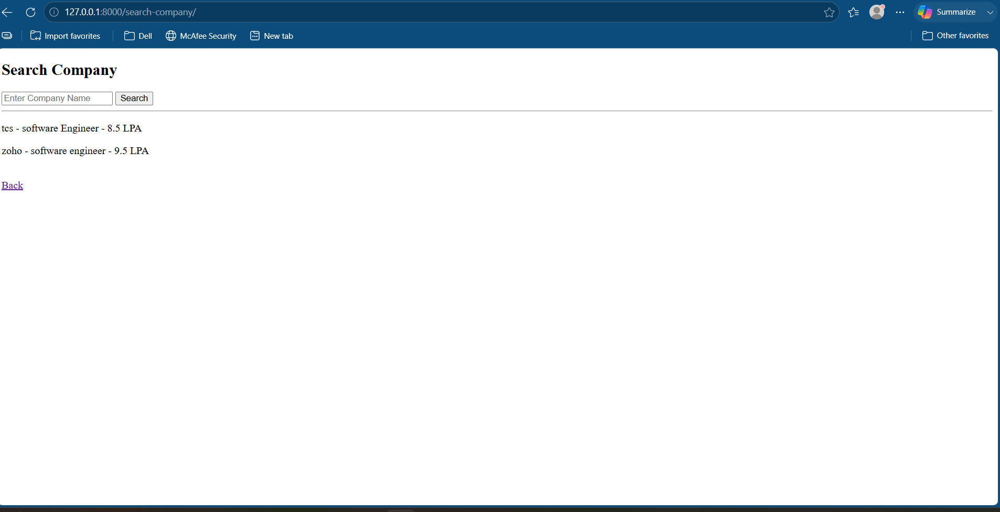
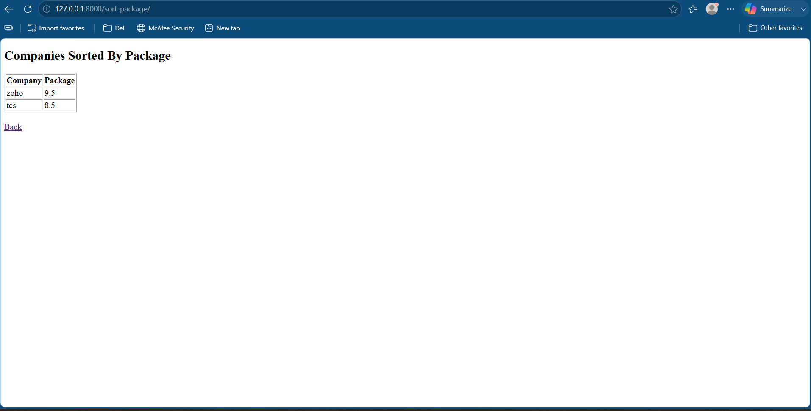
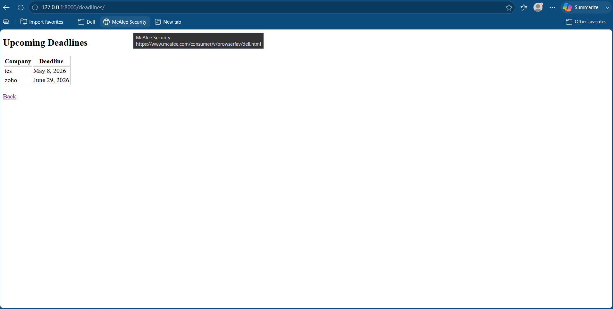

# 🎓 Campus Interview Management System
## 📸 Screenshots

### Login Window

### Student Registration

### Student Login

### Student Dashboard

### Eligibility Criteria

### Search Company

### Sort Companies by Package

### Upcoming Deadlines

---

## 🚀 Working Flow

1. Students register and create an account.
2. Students log in securely using their credentials.
3. Students can view their personalized dashboard.
4. Students search for companies based on their preferences.
5. The system checks eligibility according to company criteria.
6. Students can sort companies by salary package.
7. Students can view upcoming application deadlines.
8. The system helps students manage the campus recruitment process efficiently.
